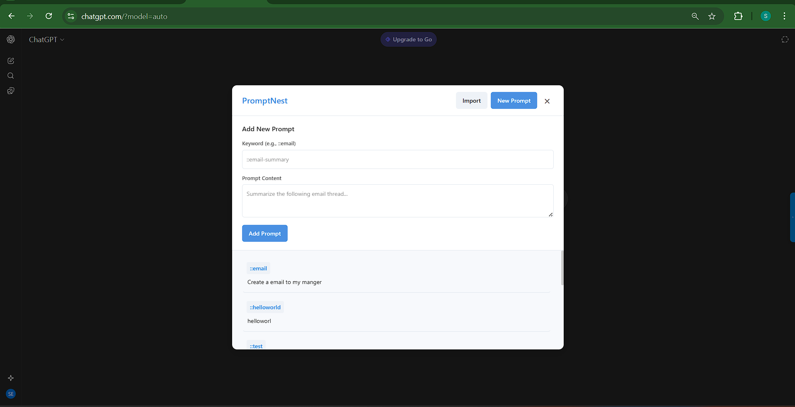

# PROMPTNEST – Prompt Manager Browser Extension


A TypeScript-based browser extension that lets you create, store, and quickly insert reusable prompts while typing on any website. Type `::keyword` in a `textarea` or contenteditable input to expand it into the saved prompt. Toggle the in-page UI with Ctrl/Cmd+Shift+P.

## Project Structure

```
project-root/
│── icons/                 # Extension icons and branding assets
│   ├── icon16.png
│   ├── icon32.png
│   ├── icon48.png
│   ├── icon128.png
│   └── logo.png
│── releases/              # Built ZIPs (e.g., PromptNest-1.0.0.zip)
│── scripts/
│   └── build-script.js    # Build & package script (esbuild + zip)
│── src/                   # TypeScript source files
│   ├── background.ts      # Background service worker (MV3)
│   ├── content.ts         # Content script: UI toggle & keyboard handling
│   ├── observers/
│   │   └── InputObserver.ts   # Observes inputs and expands ::keyword
│   ├── services/
│   │   └── PromptManager.ts   # CRUD over chrome.storage.local
│   └── Ui/
│       ├── CustomAlert.ts     # Reusable alert component
│       └── PromptUI.ts        # In-page UI for managing prompts
│── screenshots/           # Place screenshots here (referenced below)
│── manifest.json          # Extension manifest (Manifest V3)
│── tsconfig.json          # TypeScript configuration
│── package.json           # Dependencies and scripts
│── README.md              # This file
└── build/ and dist/      # Generated outputs after build
```

## Features

- **Inline expansion**: Type `::keyword` to expand into the saved prompt in `textarea` or contenteditable fields
- **In-page UI**: Manage prompts via an injected panel; no separate popup.html
- **Quick toggle**: Press `Ctrl/Cmd + Shift + P` to show/hide the PromptNest UI
- **Sidebar toggle**: A slim right-edge handle to toggle the UI with a click
- **Persistent storage**: Prompts are stored in `chrome.storage.local`
- **TypeScript + MV3**: Modern stack with esbuild bundling and MV3 service worker

## Setup

1. **Install dependencies**:
   ```bash
   npm install
   ```

2. **Build the extension**:
   ```bash
   npm run build
   ```

3. **Load in browser**:
   - Open Chrome/Edge
   - Go to `chrome://extensions/` or `edge://extensions/`
   - Enable "Developer mode"
   - Click "Load unpacked"
   - Select the `build` folder created by the build script

4. (Optional) **Grab the ZIP**: The build also creates `releases/PromptNest-<version>.zip` for distribution.

## Development

- **Watch mode**: `npm run dev` (TypeScript watch)
- **Clean build**: `npm run clean` (removes `dist` and `build`)
- **Build**: `npm run build` (bundles with esbuild, copies assets, zips release)

## Usage

Once loaded, the extension will:
1. Add a slim right-edge sidebar handle; click it to open/close the panel
2. Let you toggle the in-page UI with `Ctrl/Cmd + Shift + P`
3. Expand `::keyword` into the corresponding prompt while you type

## Screenshot



## Customization

- **UI styling**: Current styles are inline within TS files (e.g., `src/Ui/PromptUI.ts`, `src/Ui/CustomAlert.ts`). You can migrate styles to SCSS if preferred.
- **Permissions**: Update `manifest.json` permissions as needed
- **Content scripts**: Adjust `matches` in `manifest.json` to target specific sites

## Notes

- The icon files in `icons/` can be replaced with your branding assets
- Built with esbuild (IIFE) targeting modern browsers; Manifest V3 service worker is `background.js`
- Storage is local to the browser profile (`chrome.storage.local`)
